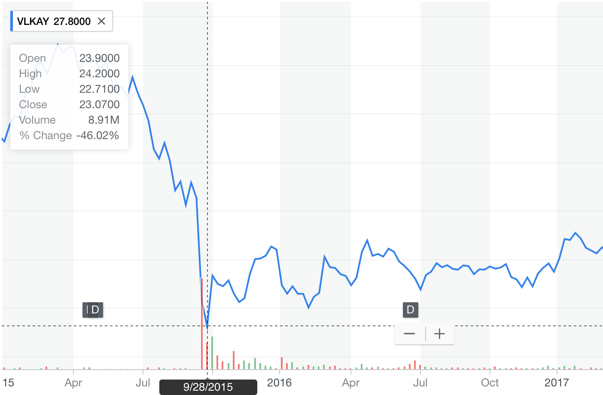

```{r setup, include=FALSE}
knitr::opts_chunk$set(echo = FALSE)
```


# PA: Applied Time Series Forecasting

## About Myself
### Klaus C. Langenheldt
* Education
    * MSc Information Systems (Data Science)
    * Industrial PhD Data Science
* Work
    * Software Engineer @ Danish Bank
    * AI Researcher @ Blackwood Seven
* Focus Areas
    * Time Series Forecasting
    * Supervised Machine Learning
    * Media Mix Modelling


## What will this Course be About?
```{r, warning = FALSE, echo = FALSE}
library(forecast)
data = ts(AirPassengers) # convert to ts object
model = ar(data, order=20)
forecast = forecast(model, h=12)
plot(forecast)
```
Monthly Airline Passenger Numbers 1949-1960 (in thousands)

## Prediction is Difficult
__'Prediction is very difficult, especially about the future.'__

- Niels Bohr (Nobel Prize for Physics in 1922, Quantum Physics)


## Valuableness of TS Forecasting
- Demand forecasting (inventory optimisation)
- Pattern recognition (anomaly detection)
- Planning & Goal setting (target metric specification)
- Weather prediction (crop yield optimisation)
- Load forecasting (server load balancing)
- ...


## Learning Objectives
[comment]: # An important area of machine learning that is often neglected. So many business problems involve a time component.

- In this course, you will learn TS forecasting such that you
    - understand the immense value of forecasting for businesses
    - grasp the limits of forecasting
    - evaluate forecasts done inside your organisation
    - can easily create a forecasting model yourself (with YOUR business data)
    - cannot longer be fooled by your data scientists


## Content
- You will learn about
    - standard definitions of time series, time series analysis, and time series forecasting
    - important components to consider in time series data
    - most common, traditional forecasting methods
    - modern, cutting-edge hyper-automated forecasting methods
    - model evaluation
    - using external data


## Timeline
- Day 1
    - Time Series Basics
    - Computer Setup / R Environment
    - Traditional Forecasting Methods

- Day 2
    - Cutting-Edge Forecasting Methods
    - Evaluating Forecasts
    - Using External Data\
    - Case Introduction

## Computer Requirements
Prerequisites:

* [R 3.0.1+](https://cran.rstudio.com)
* [R Studio](https://www.rstudio.com/products/rstudio/download/)
* Relevant libraries
    ```{r eval = FALSE, echo = TRUE}
    install.packages("prophet")
    install.packages("forecast")
    install.packages("fpp")
    install.packages("dplyr")
    ```
* Material <https://github.com/l4u532/cbs-forecasting>

## Why R?
- [Extensive Discussion on R vs. Python](https://www.quora.com/Which-is-better-for-data-analysis-R-or-Python-Is-R-still-a-better-data-analysis-language-than-Python-Has-anyone-else-used-Python-with-Pandas-to-a-large-extent-in-data-analysis-projects)
- R is the go-to software for statistics and timeseries forecasting
- Python for general purpose programming and Machine Learning
- Exposure to both programming languages is indespensible
- It looks good on your CV


## What is a Time Series?
[](https://finance.yahoo.com/quote/VLKAY/history)

_A time series is a sequence of **observations** taken sequentially in **time**._
(p. 1, Time Series Analysis: Forecasting and Control)

| Date       | Price     |
|------------|-----------|
| 2018-04-03 | 40.490002 |
| 2018-04-04 | 40.18     |
| 2018-04-05 | 40.650002 |
| 2018-04-06 | 40.209999 |
| 2018-04-07 | 40.240002 |
| 2018-04-08 | 41.849998 |

## What is a Time Series?
```{r, out.width = "700px"}

```


## Describing vs Predicting
- **Analysis**: seeks to understand the _why_, the _causalities_
$$Y = C + I + G + (X-M)$$
- **Forecasting**: find recurring patterns and extrapolate them to the future
$$Y_{t+1} = f(Y_{t_{\leq 0}})$$

($Y$ = national income,
$C$ = domestic household consumption,
$I$ = domestic investments,
$G$ = gov spend on goods/services,
$X-M$ = exports - imports)

## Components of a Time Series
- __Level__ The baseline value for the series
- __Trend__ The linear increasing or decreasing behavior over time
- __Seasonality__ The repeating patterns/cycles over time
- __Noise/Residuals/Remainder__ The variability that cannot be explained by the above
```{r, warning = FALSE, echo = F}
library(forecast)
fit <- stl(AirPassengers, t.window=15, s.window="periodic", robust=TRUE)
plot(fit)
```

## Components of a Time Series
$$Y = level + trend + seasonality + noise$$
```{r, warning = FALSE, echo = F}
library(forecast)
data = AirPassengers # change this line to provide new data
model <- stl(data, t.window=15, s.window="periodic", robust=TRUE)
plot(model)
```

## Components of a Time Series: R Code
```{r, warning = FALSE, echo = T}
library(forecast)
data = AirPassengers # change this line to provide new data
model <- stl(data, t.window=15, s.window="periodic", robust=TRUE)
plot(model)
```


## Data Obstacles
- __Granularity__ You have daily data, but want weekly/monthly/yearly forecasts.
- __Outliers__ Perhaps there are corrupt or extreme outlier values that need to be identified and handled.
- __Missing Data__ Perhaps there are gaps or missing data that need to be interpolated or imputed.
- __Intermittent Data__ Temporary out-of-stock periods or sporadic activity.

# Computer Setup 


## Required Software
* Install [R 3.0.1+](https://cran.rstudio.com)
* Install [R Studio](https://www.rstudio.com/products/rstudio/download/)
* Install relevant R libraries [See Tutorial for Help](https://www.youtube.com/watch?v=u1r5XTqrCTQ)
    ```{r eval = FALSE, echo = TRUE}
    install.packages("prophet")
    install.packages("forecast")
    install.packages("fpp")
    install.packages("dplyr")
    ```
* Download course material <https://github.com/l4u532/cbs-forecasting>
    
    
# Practical Challenge 


## The R Studio Environment
```{r, out.width = "700px"}
knitr::include_graphics("images/day1_rstudio.jpg")
```


## Decompose and Interpret a Time Series
- Copy the code from **slide #17**
- Change the data input
    ```{r, warning = FALSE, echo = T}
    data = mdeaths
    ```
- Decompose (find components) of the time series
- Interpret the decomposition, see [UK Lung Deaths Dataset](https://www.rdocumentation.org/packages/datasets/versions/3.4.3/topics/UKLungDeaths)


## Solution
```{r, warning = FALSE, echo = T}
library(forecast)
data = mdeaths # change this line to provide new data
model = stl(data, t.window=15, s.window="periodic", robust=TRUE)
plot(model)
```


## R Studio Tips
- The development environment's four building blocks
    - Script/Programming
    - Console
    - Environment/Variables
    - Plots, Files, etc.
- Code Execution
    - **Select** the code you want to execute
    - Press `CMD+Enter` (Mac) or `CTRL+Enter` (Windows)
    - Or Press `Run`


# Recap

## Recap
- How can time series forecasting create value for businesses?
- What are the four components of are time series?
- What are four building blocks of the R Studio development environment?

