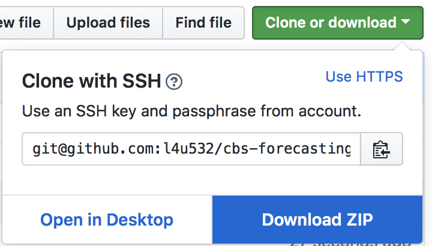

```{r setup, include=FALSE}
knitr::opts_chunk$set(echo = FALSE)
```

# Recap of Day 1

## First of All
**Download Updated Lecture Slides**
<https://github.com/l4u532/cbs-forecasting>

```{r, out.width = "700px"}

```

## R Environment
- 4 Parts
- Line-by-line execution
- Plots
- Inspecting data

## Inspecting Data

```{r, echo=T, eval=F}
library(forecast)
data = AirPassengers
head(data) #1 show first 10 obs
View(data) #2 print data content as dataframe
print(data) #3 print data content
```

## Get a Sense of the Data
- Load the the `ukcars` dataset
    ```{r, echo=T, eval=F}
    library(fpp)
    data = ukcars
    ```
    
- What is the data? `?ukcars`
- Inspect the data using `head`, `View`, `print`


## Predict
- Use the learnings from day 1 to predict, using
    - `ma()`
    - `ar()`
    - `auto.arima()`
- Find the example code in `day1/day1b-methods.html`
- **BEWARE** Do _not_ use the `ts()` conversion
    - otherwise the frequency information will be lost
    - check frequency with `frequency()` (quartlery = `4`)

## Example of Faulty `ts()` Conversion
```{r, echo=T, warning=F, message=F}
library(fpp)
ts_data = ts(ukcars)
model = auto.arima(ts_data)
forecast = forecast(model, h=30)
plot(forecast)
```

## Example of Faulty `ts()` Conversion
```{r, echo=T}
library(fpp)
data = ukcars
model = auto.arima(data)
forecast = forecast(model, h=30)
plot(forecast)
```

## Example of Faulty `ts()` Conversion
```{r, echo=T}
frequency(ukcars)
frequency(ts(ukcars))
```

## Prophet
- fully automatic
- fourier transform
- trend
- events

$$Y = level + trend + seasonality + holidays + noise$$

## Prophet Deep Dive
<https://peerj.com/preprints/3190.pdf>

# Collaborative Project: Predict with `prophet`

## Collaborative Project: Predict with `prophet`
- data: `day2/data/prophet-ukcars.R`
- horizon = `2` years
- frequency = `quarter`


## Working with Prophet by yourself
Utilise the documentation
<https://facebook.github.io/prophet/docs/quick_start.html>


# Using External Data

## For which influence factor do you Know its **FUTURE** value?
- Gasoline prices (car sales)
- Weather (icecream consumption)
- Competitor activity
    - ad spend
    - pricing
    - promotions
- **Product launches (iPhone launch)**
- **Black Friday**
- **Bank Holidays**
- **Football playoffs**


## Your Know Your own Ad Spend
`day2/day2c-blackwood7.pdf`

## Media Mix Modelling
$$Y _ { t } = \alpha + \beta _ { 1} A _ { t } + \beta _ { 2} P _ { t } + \beta _ { 3} R _ { t } + \beta _ { 4} Q _ { t } + \varepsilon _ { i }$$
($A, P, R, Q$ = Email, Price, Display Ads, SEO, TV, Paid Search, Print)


$$Sales = 169 + 2.5*Email + 45*Price + 3.5*TV$$


[Paper](http://citeseerx.ist.psu.edu/viewdoc/summary?doi=10.1.1.120.3536&rank=1)

## I know my Data
- Finding Causality vs. Forecasting
- If $\beta$ of own data impactful, can do forecasting
- Otherwise external data not sensible
    - you need to know its future values
    - calendar events work